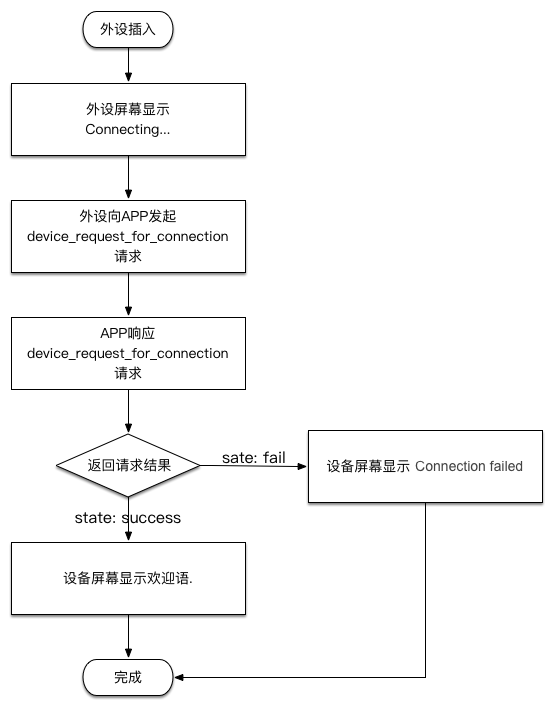

# APP与HD Wallet交互用例

<table>
  <tr><th>用例</th></tr>
  <tr><td><a href="#device_request_for_connection">设备每次插入手机</a></td></tr>
</table>

## APP与HD Wallet交互的重点注意事项

每个设备在出厂时，均会内置<code>device_id</code>和<code>api_secret</code>。

所有请求的数据中均会带有如下5个属性，分别是：
<pre><code>api_version: 协议版本
method: 接口名称
timestamp: 当前发起请求的时间戳
device_id: 设备的ID
sign: 用于校验数据来源的签名</code></pre>

## 用例

### 设备每次插入手机

#### 请求发起方
  
  硬件设备

#### 使用的接口
<pre><code>device_request_for_connection</code></pre>

#### 目的
  
  外设插入手机后，需要把外设的基本信息传给APP。只有连接成功后，才能进行后续的操作。

### 流程

### 